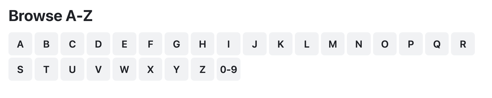

# Angular-June-2024-Project

## Medication Reviews/Side-Effects application:
The application helps users to review and report medications side effects.

<p align="center">
  
</p>

1. Guests browse the medications by the first letter. Display all the alphabet letters, when a letter is clicked all medications starting with the letter are fetched and displayed. All guests can read the reviews. You may use the [Drugs.com](https://www.drugs.com/drug_information.html) to see sample data.
2. Guests will need to signup and signin before they can add medications or reviews.
3. Users may add medications. Only the medication owner may update or delete their medication.
4. Users may submit reviews. Only the review owner may update or delete their reviews.
  
### Application specifications and requirements
Your project must use the following:  
* Implement a login-based system with JWT.  
* Browsing medications and reading reviews is open to guests, but adding, updating, and deleting functionality is restricted to logged-in users.
* State properties in all components and services should be declared as a `signal`.
* Implement proper lazy-loading techniques for the user-protected components.
* Projects must use Angular Material and have proper UI that complies with the web standards. Other UI kits are not permitted.
* You must use the latest Angular version features, and avoid using any legacy Angular APIs. 
* You must use the `ReactiveFormsModule` when working with form elements (data-driven). The `FormsModule` (template-driven) should not be used.
   

##  Extra Requirement
* Implement a new backend API/route to check if the medication name exists or not. This will be used from an asynchronous validator to invalidate the form status in the frontend.
  

## Extra Requirement
* Build you Angular project and modify the backend code to serve the Angular SPA as follows:
   * Define an `Express.static()` middleware that serves the Angular SPA.
   * Define a backend fallback route that serves the Angular SPA for any undefined backend route.


```typescript
export type User = { _id: string, fullname: string, email: string, password: string }
export type Image = { filename: string, originalname: string }
export type Review = { review: string, rating: number, by: { user_id: string, fullname: string }, date: number }
export type Owner = { user_id: string, fullname: string, email: string }
export type Medication = {
    name: string,
    first_letter: string,
    generic_name: string,
    medication_class: string,
    availability: string,
    image: Image,
    added_by: Owner,
    reviews: Review[]
}
// POST /users/signin
request_body = { "email": string, "password": string }
response_body = { "success": boolean, "data": string } // JWT token
  
// POST /users/signup
request_body = { "fullname": string, "email": string, "password": string }
response_body = { "success": boolean, "data": User } 

// POST /medications
request_body = { "name": string, "generic_name": string, "medication_class": string, "availability": string }
request_multipart = "medication_image"
response_body = { "success": boolean, "data": Medication }

// GET /medications?first_letter=A
response_body = { "success": boolean, "data": Medication[] } // only name

// PUT /medications/:medication_id
request_body = { "name": string, "generic_name": string, "medication_class": string, "availability": string }
request_multipart = "medication_image"
response_body = { "success": boolean, "data": boolean }

// GET /medications/:medication_id
response_body = { "success": boolean, "data": Medication } // without reviews

// DELETE /medications/:medication_id
response_body = { "success": boolean, "data": boolean }

// POST /medications/:medication_id/reviews
request_body = { "review": string, "rating": number }
response_body = { "success": boolean, "data": string } // review_id

// GET /medications/:medication_id/reviews
response_body = { "success": boolean, "data": Review[] } // only name

// PUT /medications/:medication_id/reviews/:review_id
request_body = { "review": string, "rating": number }
response_body = { "success": boolean, "data": boolean }

// GET /medications/:medication_id/reviews/:review_id
response_body = { "success": boolean, "data": Review }

// DELETE /medications/:medication_id/reviews/:review_id
response_body = { "success": boolean, "data": boolean }

// GET /medications/images/:image_id
response_body = Binary of image file
```
